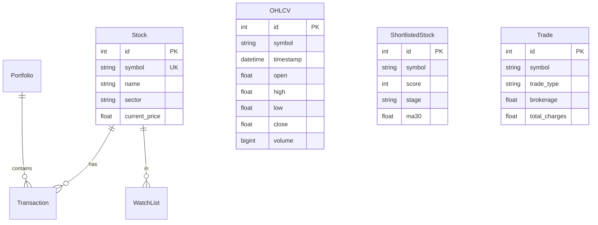
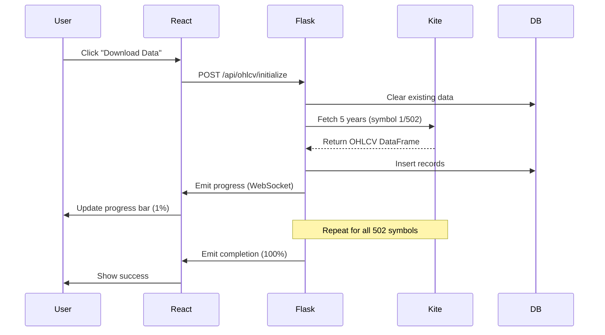
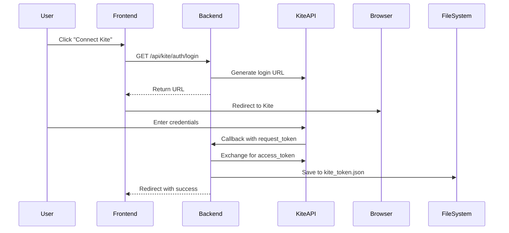

# Stock Analyzer - Developer Guide

> **A comprehensive full-stack stock market analysis application for Indian markets (Nifty 500)**

Welcome to the Stock Analyzer project! This guide will help you understand the codebase and get started with development.

---

## 📚 Documentation Index

| Document | Purpose |
|----------|---------|
| **[HLD.md](./HLD.md)** | High-Level Design - System architecture, technology stack, data flows |
| **[LLD.md](./LLD.md)** | Low-Level Design - Detailed API specs, algorithms, implementation details |
| **This README** | Quick start guide for developers |

---

## 🎯 What is Stock Analyzer?

Stock Analyzer is a **real-time stock market analysis tool** that:
- Fetches 5 years of historical data for 500+ Indian stocks
- Applies technical analysis (RSI, MACD, EMA crossovers)
- Implements **Weinstein Stage Analysis** for stock screening
- Provides interactive sector heatmaps and candlestick charts
- Manages portfolios, trades, and watchlists
- Calculates Indian market brokerage costs

### Tech Stack at a Glance
```
Backend:  Python 3 + Flask + SQLAlchemy + SQLite
Frontend: React 18 + Plotly.js + Socket.IO
API:      Kite Connect (Zerodha)
```

---

## 🚀 Quick Start (5 Minutes)

### Prerequisites
```bash
# Check if you have the required tools
python3 --version  # Should be 3.8+
node --version     # Should be 14+
npm --version      # Should be 6+
```

### Installation
```bash
# 1. Clone the repository
git clone <repo-url>
cd stockAnalyzer-1

# 2. Run the startup script
chmod +x start.sh
./start.sh
```

**That's it!** The script will:
- ✅ Create Python virtual environment
- ✅ Install backend dependencies
- ✅ Start Flask server (Port 5000)
- ✅ Install frontend dependencies
- ✅ Start React dev server (Port 3000)
- ✅ Open Chrome browser automatically

### Alternative: Double-Click Launch (macOS)
```bash
# Use the macOS app bundle
open "Stock Analyzer.app"
```

---

## 📁 Project Structure

```
stockAnalyzer-1/
├── backend/                    # Python Flask backend
│   ├── app.py                 # Application entry point
│   ├── models.py              # Database models (7 tables)
│   ├── config.py              # Configuration (API keys, DB)
│   ├── extensions.py          # Shared extensions (db, socketio)
│   ├── routes/                # API blueprints (14 modules)
│   │   ├── ohlcv.py          # OHLCV data endpoints
│   │   ├── analysis.py       # Technical analysis
│   │   ├── weinstein.py      # Weinstein screening
│   │   ├── kite_auth.py      # Kite authentication
│   │   └── ...
│   ├── services/              # Business logic
│   │   ├── data_fetcher.py   # Data download
│   │   ├── kite_client.py    # Kite API wrapper (Singleton)
│   │   ├── weinstein_screening.py  # Weinstein algorithm
│   │   └── symbols.csv       # Stock symbols (502+)
│   └── stock_analyzer.db     # SQLite database (~120MB)
│
├── frontend/                   # React frontend
│   ├── src/
│   │   ├── App.js            # Root component
│   │   ├── components/       # React components
│   │   │   ├── SectorHeatmap.js
│   │   │   ├── Analysis.js
│   │   │   ├── WiensteinScoring.js
│   │   │   ├── Shortlist.js
│   │   │   ├── CandlestickChart.js
│   │   │   └── DataDownload.js
│   │   └── services/
│   │       └── api.js        # API client functions
│   └── package.json
│
├── docs/                       # Documentation
│   ├── HLD.md                 # High-Level Design
│   ├── LLD.md                 # Low-Level Design
│   └── DEVELOPER_README.md    # This file
│
├── start.sh                    # Startup script
└── Stock Analyzer.app/         # macOS launcher
```

---

## 🗄️ Database Schema

### Core Models



**Database File**: `backend/stock_analyzer.db` (SQLite, ~120MB)  
**Records**: ~632,520 OHLCV records (502 stocks × 5 years)

See [LLD.md](./LLD.md#2-database-models-modelspy) for detailed schema.

---

## 🔌 API Endpoints Overview

| Endpoint | Method | Purpose |
|----------|--------|---------|
| `/api/ohlcv/initialize` | POST | Download 5-year data for all stocks |
| `/api/ohlcv/data` | GET | Query OHLCV data with filters |
| `/api/ohlcv/sector-heatmap` | GET | Get sector performance data |
| `/api/analysis/data` | GET | Get technical analysis for all stocks |
| `/api/analysis/chart/:symbol` | GET | Get chart data with indicators |
| `/api/weinstein/scores` | GET | Get Weinstein screening scores |
| `/api/weinstein/shortlist` | POST | Add stock to shortlist |
| `/api/kite/auth/login` | GET | Get Kite OAuth login URL |
| `/api/kite/auth/callback` | GET | OAuth callback handler |
| `/api/trades` | POST | Create trade with brokerage calc |

**Full API documentation**: [LLD.md - Section 3](./LLD.md#3-api-routes)

---

## 🧠 Key Algorithms

### 1. Weinstein Stage Analysis

**Purpose**: Identify stocks in **Stage 2** (bullish uptrend)

**Process**:
```python
1. Convert daily OHLCV → Weekly OHLCV (resample to Friday)
2. Calculate 30-week Moving Average (MA30)
3. Calculate Relative Strength vs NIFTY 50 (52-week avg)
4. Determine Stage:
   - Stage 2: price > MA30 AND MA30 trending up
   - Stage 4: price < MA30 AND MA30 trending down
5. Apply 3 filters:
   ✓ Stage 2 (Bullish) → 33.33 points
   ✓ Low Resistance (close within 5% of high) → 33.33 points
   ✓ Not Overextended (< 20% above MA30) → 33.34 points
6. Score: 0-100 (100 = passes all conditions)
```

**Implementation**: `backend/services/weinstein_screening.py`

---

### 2. Technical Analysis Scoring

**Purpose**: Score stocks based on 4 technical indicators

```python
Score Calculation (100 points max):
├── RSI 30-70 (neutral zone) → +25 points
├── MACD Bullish (MACD > Signal) → +25 points
├── EMA 21 > EMA 44 → +25 points
└── Price > EMA 200 → +25 points
```

**Implementation**: `backend/routes/analysis.py:get_analysis_data()`

---

### 3. Brokerage Calculation (Indian Markets)

```python
For ₹100,000 BUY trade:
├── Brokerage: min(₹20, 0.03%) = ₹20
├── STT: 0.1% = ₹100
├── Exchange (NSE): 0.0325% = ₹32.50
├── GST: 18% on (brokerage + exchange) = ₹9.45
├── SEBI: ₹10 per crore = ₹1
└── Stamp Duty (BUY only): 0.015% = ₹15
    ────────────────────────────────
    Total Charges = ₹177.95
```

**Implementation**: `backend/services/brokerage_calculator.py`

---

## 🔄 Data Flow

### Data Download Flow



**Time**: ~15-20 minutes for full download

---

## 🎨 Frontend Components

### Component Hierarchy

```
App.js
├── KiteConnectionManager (Header right)
├── Tabs Navigation
└── Active Tab Content:
    ├── SectorHeatmap
    │   ├── Duration Selector (1d, 1w, 1m...)
    │   ├── Heatmap Grid (Color-coded sectors)
    │   └── DataDownload Modal
    │
    ├── Analysis
    │   ├── Sortable Table (500 stocks)
    │   └── CandlestickChart (on row click)
    │
    ├── WiensteinScoring
    │   └── Scoring Table (0-100 scores)
    │
    └── Shortlist
        └── Shortlisted Stocks Table
```

### Key React Patterns Used

**1. WebSocket Integration (Real-time Progress)**
```javascript
useEffect(() => {
  const socket = io();
  
  socket.on('refresh_progress', (data) => {
    setProgress(data.progress);
    setSymbol(data.symbol);
  });
  
  return () => socket.disconnect();
}, []);
```

**2. Lazy Chart Loading**
```javascript
// Chart only renders when stock is clicked
{selectedStock && (
  <CandlestickChart 
    symbol={selectedStock.symbol}
    name={selectedStock.name}
  />
)}
```

**3. Color-Coded Visualizations**
```javascript
const getColorForChange = (change) => {
  if (change >= 5) return '#006400';   // Dark Green
  if (change >= 0) return '#90EE90';   // Light Green
  if (change >= -2) return '#FFB6C6';  // Light Red
  return '#8B0000';                    // Dark Red
};
```

---

## 🔐 Kite Connect Integration

### Authentication Flow



### Setup Instructions

1. **Get API Credentials**:
   - Create Kite Connect app: https://developers.kite.trade/
   - Note API Key and Secret

2. **Update Config**:
   ```python
   # backend/config.py
   KITE_API_KEY = 'your_api_key'
   KITE_API_SECRET = 'your_secret'
   ```

3. **Authenticate**:
   - Click "Connect Kite" in app header
   - Login via Kite OAuth
   - Token saved to `backend/kite_token.json`

---

## 🛠️ Development Workflows

### Adding a New API Endpoint

1. **Create Route** (`backend/routes/myroute.py`):
```python
from flask import Blueprint, jsonify

myroute_bp = Blueprint('myroute', __name__)

@myroute_bp.route('/api/myroute/data', methods=['GET'])
def get_data():
    return jsonify({'message': 'Hello'})
```

2. **Register Blueprint** (`backend/app.py`):
```python
from routes.myroute import myroute_bp

app.register_blueprint(myroute_bp)
```

3. **Create Frontend Service** (`frontend/src/services/api.js`):
```javascript
export const fetchMyData = async () => {
  const response = await fetch('/api/myroute/data');
  return response.json();
};
```

4. **Use in Component**:
```javascript
import { fetchMyData } from '../services/api';

const MyComponent = () => {
  useEffect(() => {
    fetchMyData().then(data => console.log(data));
  }, []);
};
```

---

### Adding a New Database Model

1. **Define Model** (`backend/models.py`):
```python
class MyModel(db.Model):
    __tablename__ = 'mymodel'
    
    id = db.Column(db.Integer, primary_key=True)
    name = db.Column(db.String(100), nullable=False)
    created_at = db.Column(db.DateTime, default=get_utc_now)
    
    def to_dict(self):
        return {
            'id': self.id,
            'name': self.name,
            'created_at': self.created_at.isoformat()
        }
```

2. **Create Table**:
```python
# Run in app context
from app import app, db
with app.app_context():
    db.create_all()
```

---

### Adding a Frontend Component

1. **Create Component** (`frontend/src/components/MyComponent.js`):
```javascript
import React, { useState } from 'react';
import './MyComponent.css';

function MyComponent() {
  const [data, setData] = useState([]);
  
  return (
    <div className="my-component">
      <h2>My Component</h2>
      {/* Component JSX */}
    </div>
  );
}

export default MyComponent;
```

2. **Add to App** (`frontend/src/App.js`):
```javascript
import MyComponent from './components/MyComponent';

// In render:
<button onClick={() => setActiveTab('mycomponent')}>
  My Component
</button>

{activeTab === 'mycomponent' && <MyComponent />}
```

---

## 🐛 Debugging Tips

### Backend Debugging

**Enable Logging**:
```python
# backend/app.py
logging.basicConfig(level=logging.DEBUG)
logger = logging.getLogger(__name__)

logger.debug(f"Processing {symbol}")
```

**Check Database**:
```bash
# Open SQLite CLI
cd backend
sqlite3 stock_analyzer.db

# List tables
.tables

# Query
SELECT * FROM ohlcv_data WHERE symbol='RELIANCE.NS' LIMIT 5;

# Exit
.quit
```

**Test API Directly**:
```bash
# Using curl
curl http://localhost:5000/api/analysis/data

# Using Python
python backend/test_api.py
```

---

### Frontend Debugging

**React DevTools**:
- Install: Chrome Extension "React Developer Tools"
- Inspect component state and props

**Network Tab**:
- Open Chrome DevTools → Network
- Filter by "XHR" to see API calls
- Check request/response

**WebSocket Debugging**:
```javascript
// frontend/src/components/DataDownload.js
socket.on('refresh_progress', (data) => {
  console.log('Progress:', data);  // Add logging
  setProgress(data.progress);
});
```

---

## 🧪 Testing

### Backend Tests

```bash
# Install pytest
pip install pytest

# Run tests
pytest backend/tests/
```

**Example Test**:
```python
# tests/test_weinstein.py
def test_weinstein_scoring():
    from services.weinstein_screening import apply_filters
    
    # Mock weekly data
    df = create_mock_weekly_data()
    
    # Test
    score = apply_filters(df)
    assert score >= 0 and score <= 100
```

---

### Frontend Tests

```bash
# Run React tests
cd frontend
npm test
```

**Example Test**:
```javascript
// src/components/Analysis.test.js
import { render, screen } from '@testing-library/react';
import Analysis from './Analysis';

test('renders analysis table', () => {
  render(<Analysis />);
  const heading = screen.getByText(/Technical Analysis/i);
  expect(heading).toBeInTheDocument();
});
```

---

## 📊 Performance Optimization

### Backend Optimizations

**1. Database Indexing**:
```python
# models.py
class OHLCV(db.Model):
    symbol = db.Column(db.String(20), index=True)  # Index for fast lookup
    timestamp = db.Column(db.DateTime, index=True)
```

**2. Batch Inserts**:
```python
# Good: Batch commit
for row in df.iterrows():
    db.session.add(OHLCV(...))
db.session.commit()  # Once at end

# Bad: Individual commits
for row in df.iterrows():
    db.session.add(OHLCV(...))
    db.session.commit()  # SLOW!
```

**3. Query Optimization**:
```python
# Good: Filter at DB level
data = OHLCV.query.filter_by(symbol='RELIANCE.NS')\\
    .filter(OHLCV.timestamp >= start_date)\\
    .limit(200).all()

# Bad: Load all then filter
all_data = OHLCV.query.all()  # Loads 600K+ records!
filtered = [d for d in all_data if d.symbol == 'RELIANCE.NS']
```

---

### Frontend Optimizations

**1. Lazy Loading**:
```javascript
// Only load chart when needed
{selectedStock && <CandlestickChart symbol={selectedStock.symbol} />}
```

**2. Memoization**:
```javascript
import { useMemo } from 'react';

const sortedData = useMemo(() => {
  return data.sort((a, b) => b.score - a.score);
}, [data]);  // Only recompute when data changes
```

**3. Debouncing**:
```javascript
const debouncedSearch = useMemo(
  () => debounce((query) => fetchResults(query), 300),
  []
);
```

---

## 🚨 Common Issues & Solutions

### Issue: "Module not found" (Frontend)
```bash
# Solution: Reinstall dependencies
cd frontend
rm -rf node_modules package-lock.json
npm install
```

### Issue: "Table does not exist" (Backend)
```python
# Solution: Create tables
from app import app, db
with app.app_context():
    db.create_all()
```

### Issue: "Kite authentication failed"
```bash
# Solution: Check credentials
# 1. Verify API key/secret in config.py
# 2. Delete old token: rm backend/kite_token.json
# 3. Re-authenticate via UI
```

### Issue: "No data after download"
```python
# Solution: Check if close prices are 0
# DataFetcher skips records with close=0 (market closed)
# Try downloading on a trading day
```

---

## 📖 Learning Resources

### Understanding the Codebase

1. **Start Here**: [HLD.md](./HLD.md) - System architecture overview
2. **Deep Dive**: [LLD.md](./LLD.md) - Detailed implementation specs
3. **Code Flow**: Follow data download flow in LLD Section 4.1

### External Resources

- **Flask**: https://flask.palletsprojects.com/
- **React**: https://react.dev/
- **SQLAlchemy**: https://docs.sqlalchemy.org/
- **Plotly**: https://plotly.com/javascript/
- **Kite Connect**: https://kite.trade/docs/connect/v3/
- **Weinstein Method**: "Secrets For Profiting in Bull and Bear Markets" by Stan Weinstein

---

## 🤝 Contributing

### Code Style

**Python** (PEP 8):
```python
# Good
def calculate_rsi(prices, period=14):
    """Calculate Relative Strength Index."""
    delta = prices.diff()
    return rsi

# Bad
def calcRSI(p,per=14):return p.diff()  # No docstring, poor naming
```

**JavaScript** (Airbnb Style):
```javascript
// Good
const fetchData = async () => {
  try {
    const response = await fetch('/api/data');
    return response.json();
  } catch (error) {
    console.error(error);
  }
};

// Bad
function fetchData(){fetch('/api/data').then(r=>r.json())}  // No error handling
```

---

## 📝 Changelog

### Version History

**v1.0.0** (Current)
- ✅ 5-year OHLCV data download
- ✅ Weinstein Stage Analysis implementation
- ✅ Technical analysis (RSI, MACD, EMA)
- ✅ Sector heatmap visualization
- ✅ Kite Connect integration
- ✅ Brokerage calculator
- ✅ macOS app launcher

---

## 📞 Support

### Getting Help

1. **Check Documentation**: HLD.md and LLD.md
2. **Search Issues**: Check existing GitHub issues
3. **Ask Questions**: Create new issue with "[Question]" tag

### Reporting Bugs

```markdown
**Bug Description**: Brief summary

**Steps to Reproduce**:
1. Go to Analysis tab
2. Click on stock row
3. Chart doesn't load

**Expected**: Chart should load
**Actual**: Blank screen

**Environment**:
- OS: macOS 13.0
- Python: 3.10
- Node: 16.0
```

---

## 📄 License

[Your License Here]

---

## 🙏 Acknowledgments

- **Kite Connect API** by Zerodha
- **Stan Weinstein** for Stage Analysis methodology
- **React** and **Flask** communities

---

**Happy Coding! 🚀**

For detailed technical specifications, see:
- **[High-Level Design (HLD.md)](./HLD.md)**
- **[Low-Level Design (LLD.md)](./LLD.md)**
