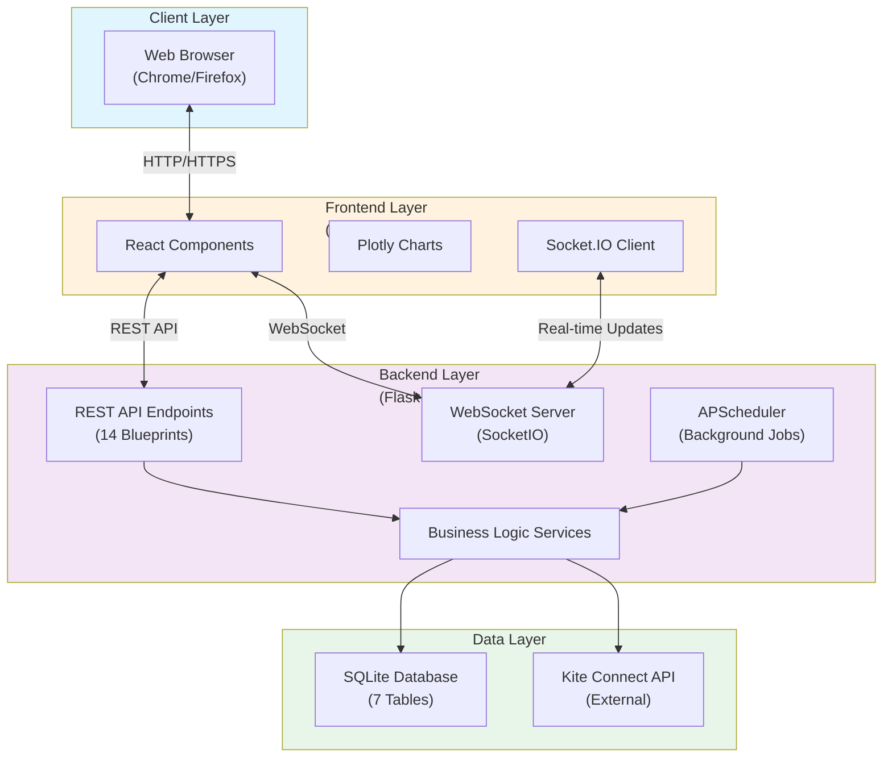
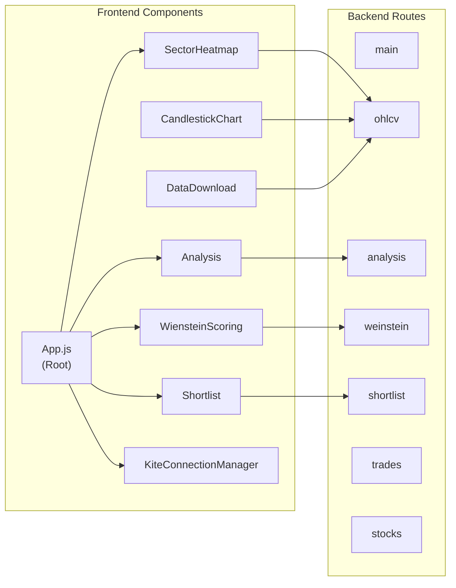
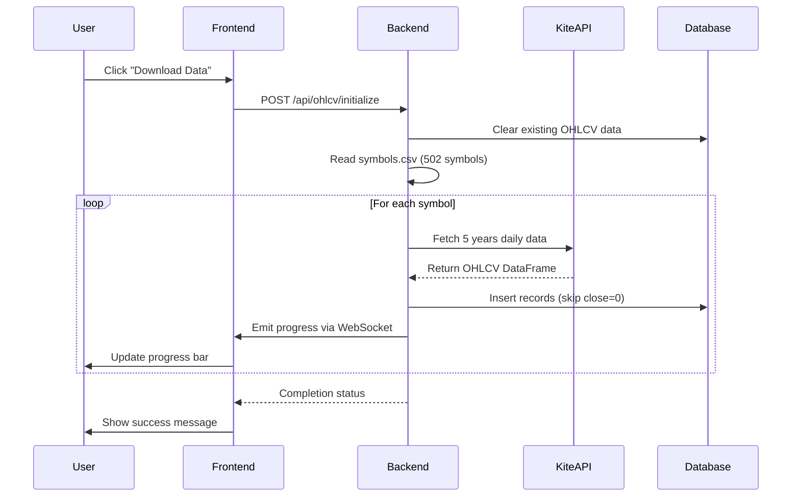
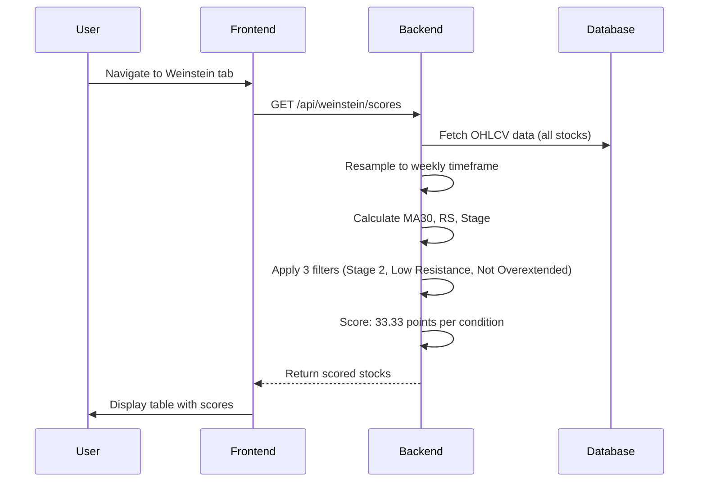
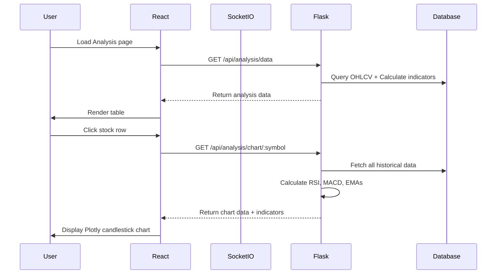
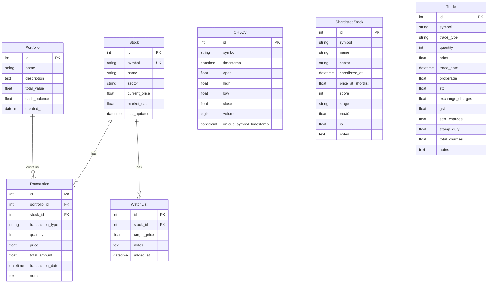
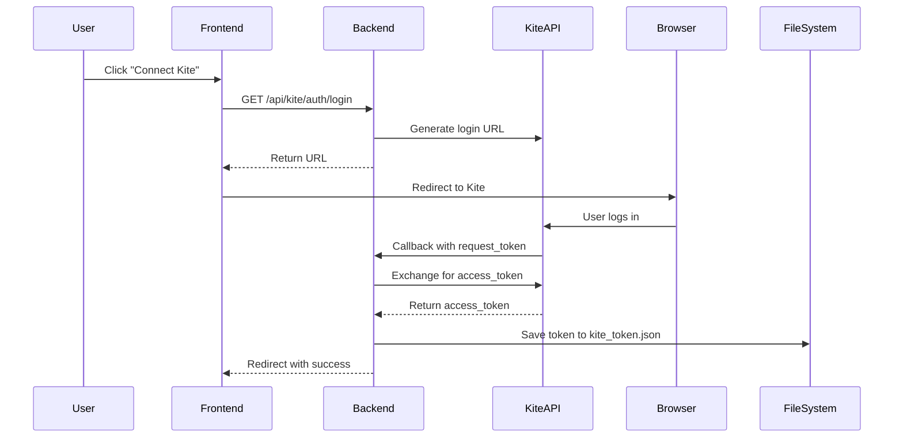
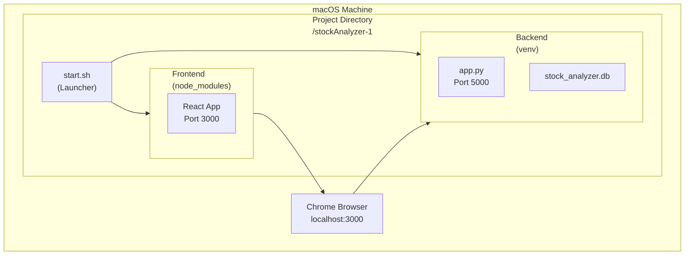

# Stock Analyzer - High-Level Design (HLD)

## 1. System Overview

Stock Analyzer is a **full-stack web application** for real-time analysis of Indian stock market data, specifically focused on the **Nifty 500** universe. The application integrates with **Kite Connect API** to fetch live and historical market data, applies technical analysis algorithms (including **Weinstein Stage Analysis**), and provides interactive visualizations for stock screening and portfolio management.

### Key Features
- **Real-time OHLCV Data**: Fetch and store 5 years of daily OHLCV data for 500+ stocks
- **Technical Analysis**: RSI, MACD, EMA crossovers, and custom scoring
- **Weinstein Screening**: Stage analysis methodology for identifying Stage 2 (bullish) stocks
- **Sector Heatmap**: Visual representation of sector-wise performance
- **Interactive Charts**: Candlestick charts with technical indicators
- **Portfolio Management**: Track trades, transactions, and watchlists
- **Brokerage Calculator**: Calculate trading costs for Indian markets

---

## 2. Technology Stack

### Backend
```
Language:   Python 3.x
Framework:  Flask (Web framework)
Database:   SQLite (ORM: SQLAlchemy)
Real-time:  Flask-SocketIO (WebSocket support)
API:        Kite Connect (Market data provider)
Scheduling: APScheduler (Background tasks)
Data:       Pandas, NumPy (Data processing)
Analytics:  pandas-ta (Technical indicators)
```

### Frontend
```
Language:   JavaScript (ES6+)
Framework:  React 18.2.0
UI:         Custom CSS (No framework)
Charts:     Plotly.js + react-plotly.js
Real-time:  socket.io-client (WebSocket)
Build:      react-scripts (Create React App)
```

### Infrastructure
```
Database:     stock_analyzer.db (SQLite, ~120MB)
Web Server:   Flask Development Server (Port 5000)
App Server:   React Dev Server (Port 3000)
Deployment:   Shell script launcher (start.sh)
```

---

## 3. System Architecture

### 3.1 High-Level Architecture Diagram



### 3.2 Component Architecture



---

## 4. Data Flow

### 4.1 Data Download Flow



### 4.2 Weinstein Screening Flow



### 4.3 Real-time Analysis Flow



---

## 5. Database Schema

### Entity Relationship Diagram



---

## 6. External Integrations

### 6.1 Kite Connect API

**Purpose**: Official Zerodha API for Indian stock market data

**Integration Points**:
- Authentication (OAuth 2.0 flow)
- Historical data fetching (OHLCV)
- Instrument token lookup
- Real-time quote retrieval

**Authentication Flow**:


**Key Methods**:
```python
- kite.generate_session(request_token) → access_token
- kite.instruments(exchange="NSE") → List of instruments
- kite.historical_data(instrument_token, from_date, to_date, interval)
```

---

## 7. API Endpoints (Overview)

| Blueprint | Base Route | Purpose |
|-----------|-----------|---------|
| `main_bp` | `/` | Health check, status |
| `stocks_bp` | `/api/stocks` | Stock CRUD operations |
| `portfolios_bp` | `/api/portfolios` | Portfolio management |
| `transactions_bp` | `/api/transactions` | Transaction records |
| `watchlist_bp` | `/api/watchlist` | User watchlists |
| `ohlcv_bp` | `/api/ohlcv` | OHLCV data fetch/query |
| `nifty500_bp` | `/api/nifty500` | Nifty 500 stock list |
| `database_bp` | `/api/database` | Database operations |
| `analysis_bp` | `/api/analysis` | Technical analysis |
| `kite_auth_bp` | `/api/kite/auth` | Kite authentication |
| `weinstein_bp` | `/api/weinstein` | Weinstein screening |
| `shortlist_bp` | `/api/shortlist` | Shortlisted stocks |
| `trades_bp` | `/api/trades` | Trade management |

---

## 8. Deployment Architecture

### Current Setup (Development)



### Launch Process
```bash
./start.sh
├── 1. Check prerequisites (Python, npm)
├── 2. Create/activate Python venv
├── 3. Install backend dependencies
├── 4. Start Flask server (background)
├── 5. Install frontend dependencies
├── 6. Start React dev server (background)
└── 7. Open Chrome browser
```

### macOS App Bundle
```
Stock Analyzer.app/
└── Contents/
    ├── Info.plist        # App metadata
    ├── MacOS/
    │   └── launcher      # Opens Terminal + runs start.sh
    └── Resources/
        └── AppIcon.png   # Custom icon
```

---

## 9. Key Design Decisions

### 9.1 Why SQLite?
- ✅ Single-user application
- ✅ No separate database server needed
- ✅ Simple deployment
- ✅ Adequate for 500 stocks × 5 years = ~600K records
- ❌ Not suitable for multi-user or high concurrency

### 9.2 Why Flask + React (Not Next.js)?
- ✅ Clear separation of concerns
- ✅ Python ecosystem for financial calculations
- ✅ React for dynamic UI
- ❌ Requires two servers (more complex deployment)

### 9.3 Why WebSocket (SocketIO)?
- ✅ Real-time progress updates during data download
- ✅ Bi-directional communication
- ✅ Better UX for long-running operations

### 9.4 Why Weekly Resampling (Weinstein)?
- ✅ Reduces noise from daily fluctuations
- ✅ Aligns with Stan Weinstein's methodology
- ✅ Easier to identify long-term trends

---

## 10. Performance Considerations

### Data Volume
- **Stocks**: 502 (Nifty 500 + few more)
- **Historical Period**: 5 years
- **Daily Records**: ~1,260 trading days
- **Total OHLCV Records**: 502 × 1,260 = ~632,520 records
- **Database Size**: ~120 MB

### Optimization Strategies
1. **Indexing**: Symbol + Timestamp composite index
2. **Batch Inserts**: Commit every stock (not every row)
3. **Skip Invalid Data**: Close price = 0 → skip
4. **Lazy Loading**: Charts load only when clicked
5. **Caching**: Instruments cached in KiteClient

---

## 11. Security Considerations

> [!WARNING]
> **Hardcoded Credentials**: `config.py` contains Kite API keys. Move to environment variables in production.

```python
# config.py (Current - Insecure)
KITE_API_KEY = 'iyi9a2huwplqqzvg'
KITE_API_SECRET = 'zd5b9dc6shmnwxjuquydj0rgjalkp526'

# Recommended (Production)
KITE_API_KEY = os.environ.get('KITE_API_KEY')
KITE_API_SECRET = os.environ.get('KITE_API_SECRET')
```

### Access Token Storage
- Stored in `kite_token.json` (plain text)
- ⚠️ File permissions should be `600` (owner read/write only)

### CORS
- Currently allows `origins: "*"` (all origins)
- 🔒 Restrict to specific domains in production

---

## 12. Scalability & Future Enhancements

### Current Limitations
- ❌ Single-user only (SQLite)
- ❌ No user authentication
- ❌ No data backup/restore
- ❌ Manual data refresh required

### Potential Improvements
1. **Multi-user Support**: Migrate to PostgreSQL, add user auth
2. **Automated Data Refresh**: Scheduled downloads (daily/weekly)
3. **Cloud Deployment**: Deploy to AWS/GCP/Heroku
4. **Mobile App**: React Native wrapper
5. **Backtesting**: Test strategies on historical data
6. **Alerts**: Email/SMS notifications for shortlisted stocks
7. **Export**: PDF reports, Excel exports

---

## 13. Technology Dependencies

### Backend Dependencies
```
flask                  # Web framework
flask-cors            # CORS handling
flask-sqlalchemy      # ORM
sqlalchemy            # Database abstraction
yfinance              # Fallback data source
APScheduler           # Background jobs
pandas                # Data manipulation
pandas-ta             # Technical analysis
flask-socketio        # WebSocket support
python-socketio       # SocketIO implementation
kiteconnect           # Official Kite API client
pyopenssl             # SSL/TLS support
openpyxl              # Excel export
```

### Frontend Dependencies
```
react                 # UI library
react-dom             # React renderer
plotly.js             # Charting library
react-plotly.js       # React wrapper for Plotly
socket.io-client      # WebSocket client
react-scripts         # Build tooling
```

---

## 14. Glossary

| Term | Definition |
|------|------------|
| **OHLCV** | Open, High, Low, Close, Volume - standard candlestick data |
| **Weinstein Stage Analysis** | Technical analysis method identifying 4 market stages |
| **Stage 2** | Bullish/advancing phase in Weinstein methodology |
| **RSI** | Relative Strength Index (momentum indicator) |
| **MACD** | Moving Average Convergence Divergence |
| **EMA** | Exponential Moving Average |
| **Nifty 500** | Stock index of top 500 companies on NSE |
| **Kite Connect** | Zerodha's official trading API |

---

**Document Version**: 1.0  
**Last Updated**: December 2025  
**Author**: Stock Analyzer Development Team
